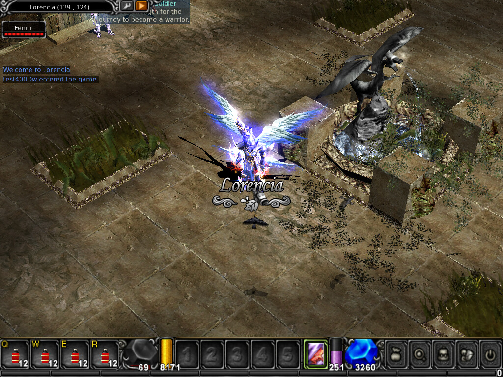

# OpenMU — Server & Client toolkit

Bộ công cụ và ghi chép khi dựng thử **MU Online** mã nguồn mở end-to-end:
server [OpenMU](https://github.com/MUnique/OpenMU) + client
[MuMain](https://github.com/sven-n/MuMain), rồi mổ xẻ giao thức giữa hai bên.

Mọi thứ trong repo này đã được chạy thật, không phải lý thuyết. Các con số,
log và ảnh đều lấy từ phiên chạy thực tế trên Ubuntu 24.04.

---

## Đã làm được gì

| | |
|---|---|
| Server | OpenMU all-in-one qua Docker, lên trong ~55 giây, 3 game server online |
| Client | MuMain build từ source Linux x64 — 997/997 target, 321/321 test pass |
| Kết nối | Đăng nhập, chọn nhân vật, đi lại, đánh quái, warp 6 map |
| Giao thức | Dump 351 packet đã giải mã của một phiên đầy đủ, opcode tra ra tên |
| Chống cheat | Inject packet speedhack — server phát hiện và ban trong ~55 giây |



---

## Tài liệu

| Tài liệu | Nội dung |
|---|---|
| [01 — Dựng server](docs/01-dung-server.md) | Docker compose, hai cái bẫy làm game server chết im lặng, tài khoản test |
| [02 — Build client](docs/02-build-client.md) | Toolchain Linux/Windows, 3 thứ docs thiếu, control socket điều khiển client bằng script |
| [03 — Dump packet](docs/03-dump-packet.md) | Vì sao tcpdump không đủ, proxy MITM giải mã, bộ decode opcode |
| [04 — Chống speedhack](docs/04-anticheat-walk.md) | So WalkRequest với ObjectWalkedExtended, mổ thuật toán, thí nghiệm inject |

---

## Bắt đầu nhanh

```bash
# 1. Dựng server (cần Docker)
./scripts/openmu-up.sh ~/OpenMU
#    -> admin panel http://localhost/
#    -> connect server 127.0.0.1:44405
#    -> tài khoản test: test400 / test400

# 2. Build client (cần CMake >= 3.25, .NET SDK 10)
./scripts/mumain-build.sh ~/MuMain
cd ~/MuMain/out/build/linux-x64/src/Release && ./Main

# 3. Điều khiển client bằng script (build với CONTROL_SOCKET=ON)
MU_CONTROL_SOCKET=/tmp/mu.sock ./Main /u127.0.0.1 /p44405 &
MU_CONTROL_SOCKET=/tmp/mu.sock ./scripts/mu-drive.py

# 4. Dump packet
cd mu-proxy && dotnet build -c Release -p:OpenMuPath=$HOME/OpenMU
dotnet run -c Release --no-build -- --out /tmp/mu-packets.jsonl
./scripts/mu-packet-decode.py /tmp/mu-packets.jsonl --openmu ~/OpenMU
```

---

## Nội dung repo

```
docs/         4 tài liệu tiếng Việt, mỗi bước đều kèm số đo thật
scripts/      openmu-up.sh        dựng server một lệnh
              mumain-build.sh     build client một lệnh
              mu-drive.py         điều khiển client qua control socket
              mu-packet-decode.py giải mã dump, tra opcode từ XML của OpenMU
              mu-walk-analyze.py  ghép WalkRequest <-> ObjectWalkedExtended
mu-proxy/     proxy MITM (C#) giải mã SimpleModulus + Xor32 bằng chính code OpenMU
samples/      dump packet, log anti-cheat, kết quả phân tích — dữ liệu thật
screenshots/  Lorencia, Devias, Dungeon, Atlans, Tarkan, Icarus
```

---

## Vài phát hiện đáng chú ý

**Game server có thể chết im lặng.** OpenMU mặc định gọi API ngoài để lấy IP
công cộng. Máy sau proxy/NAT thì game server không start, nhưng admin panel vẫn
HTTP 200 và `docker ps` vẫn hiện port mở (đó là docker-proxy bind port host,
không phải process listen). Fix bằng `RESOLVE_IP=loopback`.

**55% băng thông là `ObjectWalked`.** Trong 351 packet của một phiên, 193 gói chỉ
để đồng bộ đường đi của quái trong tầm nhìn. Đây là chỗ tối ưu đầu tiên nếu định
làm server đông người — không phải combat hay item.

**Client tự quyết có mã hoá hay không bằng số port.**

```cpp
// MuMain/src/source/Network/Server/WSclient.cpp:356
const bool isEncrypted = Port > 0xADFF || Port < 0xAD00;
```

Chính comment `todo:` ngay trên dòng đó cũng thừa nhận đây là giả định tồi.

**Opcode phụ thuộc ngôn ngữ client.** Gói di chuyển là `0xD4` với bản English
nhưng **`0xD9` với bản Việt/Trung**, `0xD3` Hàn, `0xD7` Thái.

**Chống speedhack đo điểm xuất phát, không đo quãng đường.** Và hàng đợi bị xoá
sạch nếu hai request cách nhau quá 2 giây, hoặc khi vào safezone.

---

## Pháp lý

**OpenMU** (server): giấy phép MIT, viết lại hoàn toàn từ đầu, không dựa trên
source server decompile. Dùng thoải mái.

**MuMain** (client): repo gốc không có file LICENSE, xuất phát từ source client
Season 5.2 rò rỉ của Webzen. Học hành, vọc vạch thì bình thường — nó public
nhiều năm và do chính tác giả OpenMU duy trì — nhưng đừng thương mại hoá.

Repo này **không chứa** source hay asset của OpenMU/MuMain. Các script sẽ tự
clone chúng từ upstream.
